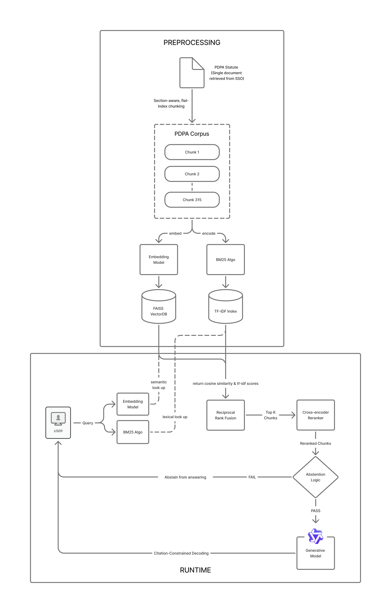

# PDPA Legal QA System – Source Directory `(src/)`

This subdirectory implements the complete **retrieval-augmented legal question-answering (RAG)** pipeline for the **PDPA-grounded Data Privacy QA System**.  
It enables **citation-constrained**, **abstention-capable** reasoning using *small language models (SLMs)* grounded in Singapore’s *Personal Data Protection Act (PDPA)*.

The architecture is designed for modularity, supporting independent experimentation, orchestration, and reproducibility across retrieval, reranking, and generation stages.

---

## Table of Contents
- [PDPA Legal QA System – Source Directory `(src/)`](#pdpa-legal-qa-system--source-directory-src)
  - [Table of Contents](#table-of-contents)
  - [Architecture Overview](#architecture-overview)
  - [1. PDPA Corpus Generation](#1-pdpa-corpus-generation)
  - [2. Generator](#2-generator)
  - [3. PDPABench Creation](#3-pdpabench-creation)
  - [4. RAG Service](#4-rag-service)
  - [5. Rerankers](#5-rerankers)
  - [6. Retrievers](#6-retrievers)
  - [Core Design Principles](#core-design-principles)
  - [How to Use](#how-to-use)
    - [RAG Inference via the API endpoints](#rag-inference-via-the-api-endpoints)

---

## Architecture Overview


The end-to-end pipeline retrieves statutory evidence, reranks candidates for contextual precision, and generates legally grounded answers with abstention fallback when retrieval confidence is insufficient.

---

## 1. PDPA Corpus Generation

**Directory:** `corpus-gen/`  

Contains preprocessing scripts to build a structured, citation-aware PDPA corpus.

- **`chunk_and_extract.py`**  
  Parses statutory text into hierarchical segments (Parts → Sections → Subsections).  
  Generates JSONL chunks with canonical citation anchors (e.g., `PDPA s.4(1)(b)`), ensuring each chunk can be retrieved and referenced deterministically.

---

## 2. Generator

**Directory:** `generator/`  

Implements the *controlled answer generation* component that transforms retrieved legal evidence into concise, PDPA-grounded answers.

- **`config.py`** – Central configuration for model hyperparameters, retrieval endpoints, and evaluation settings.  
- **`guardrails.py`** – Defines abstention logic and factuality filters, ensuring that model outputs remain within supported evidence boundaries.  
- **`slm.py`** – Core SLM generation logic supporting dual-mode decoding:
  - **Reasoning mode:** enables multi-pass reasoning traces.  
  - **Non-reasoning mode:** lightweight factual generation for low-latency responses. (Default)

---

## 3. PDPABench Creation

**Directory:** `qa-gen/`  

Manages dataset synthesis, validation, and schema enforcement. Model-assisted question generation templates producing large-scale synthetic QA pairs.  

- **`automated/`** – Automated QA generation using OpenAI's API
- **`manual/`** – Semi-automated QA generation via ChatGPT Plus. More instructions are located in `data/qa/prompts/README.md` on how it is done.
- **`pdpa_dataset_validator.py`** – Verifies dataset integrity:
  - Ensures canonical citation references (e.g., `s.26(1)(b)`) are valid.  
  - Checks section disjointness across train/validation/test splits.  
  - Validates JSONL schema consistency (`question_user`, `gold_answer_short`, `canonical_sections`, etc.).

---

## 4. RAG Service

**Directory:** `rag_service/`  

The top-level entry point coordinating the full retrieval-to-generation flow.

- **`orchestrator.py`** – Manages end-to-end orchestration across retrievers, rerankers, and generators.  
  Implements multi-stage retrieval (BM25 → Dense → Cross-Encoder → Generator) with structured logging and error propagation.  
  Wraps the entire RAG system into 3 API endpoints: `\ask`, `\ask_no_rag`, `\evaluate`. 
- **`eval_runs/`** – Stores final evaluation results for different configuration runs. Separated by SLM models tested then their respective qualitative and quantitative evaluation results. For qualitative results, please refer to `src/rag_service/eval_runs/qwen_3_4b/qualitative_eval/human/README_eval.md` for more information on how it is done. For quantitative results, it is evaluated via the `\evaluate` endpoint. An example is shown at in [How To Run](#how-to-use).

---

## 5. Rerankers

**Directory:** `rerankers/`  

Implements second-stage reranking to improve retrieval precision and contextual grounding.

- **`cross_encoder_reranker/`** – Transformer-based cross-encoder for fine-grained relevance scoring.  
- **`ltr_reranker/`** – Learning-to-Rank (LTR) model (e.g., LambdaMART, pairwise hinge loss) trained on PDPA-specific labeled triples.

---

## 6. Retrievers

**Directory:** `retrievers/`  

Implements multiple first-stage retrieval strategies and evaluation utilities. Retrieval-specific evaluation results are also stored within their respective folders. 

- **`bm25_retrieval/`** – Sparse lexical retriever (Okapi BM25 baseline).  
- **`dense_retrieval/`** – Dense vector retriever using Sentence-Transformer encoders (E5, MiniLM).  
  - Fine-tuned using PDPA QA triples with **section-disjoint** dataset splits to prevent leakage.  
- **`hybrid_retrieval/`** – Combines BM25 and dense retrievers via **Reciprocal Rank Fusion (RRF)** or learned weighting.  
- **`retrieval_evaluation/`** – Unified evaluation script for evaluating all retrievers on retrieval metrics (`Recall@K`, `NDCG@K`, `MRR`).
- **`kfold_results/`** & **`stratified_results/`** – Evaluation scripts and summaries for both K-Folds evaluation and normal 8:1:1 train-test-val split evaluation. Stratified results also contain the results for the best hyperparameters chosen.
- **`create_stratified_splits.py`** – Generates 8:1:1 train/val/test splits, balanced across four QA types (pure-definitive, definitive-with-condition, scenario-ambiguous, pure-abstain).  
- **`dense_chunk_and_extract.py`** – Embedding-precomputation pipeline for dense retrievers finetuning process.
- **`finetune_and_eval.py`** – Main retriever training loop (contrastive loss) with evaluation callbacks.

---

## Core Design Principles

1. **Section-Aware Disjoint Splitting**  
   Each dataset split is disjoint by section to avoid contamination between training and evaluation, enforcing true generalization to unseen legal provisions.

2. **Multi-Stage Retrieval and Abstention**  
   Uses a staged pipeline—retrieval → reranking → generation—with an abstention mechanism triggered by retrieval confidence margins.

3. **Reproducible Experimentation**  
   Deterministic seed control, JSON logging, and config versioning ensure end-to-end reproducibility.

4. **Grounded Evaluation Framework**  
   Combines quantitative metrics (Recall@K, NDCG@K) with human qualitative scores (Factuality, Usefulness, Pairwise Preference).


## How to Use
### RAG Inference via the API endpoints
1. Start up the API service
   ```bash
    cd src/rag_service
    uvicorn orchestrator:app --reload --port 8000
    ```
    > [!TIP] Open a new terminal window after this step

- ### Single Question Query
    ```bash
    curl -s -X POST http://localhost:8000/ask \
     -H "Content-Type: application/json" \
     -d '{"qid":"q1","question":"<INSERT YOUR QUESTION HERE>"}' \
     | jq .
    ```
    The default mode is **Non-Reasoning,** if you want to use the **Reasoning Mode**, please go to `src/generator/config.py` and change the `USE_REASONING` parameter to True. Then refresh `orchestrator.py` to register the changes. It should print the reasoning trace now. 

- ### Batch Evaluation
    ```bash
    # Evaluate with RAG
    curl -s -X POST http://localhost:8000/evaluate \
     -H "Content-Type: application/json" \
     -d '{"run_name":"rag","with_rag":"True","test_path":"../../data/dense_training/stratified_splits/test_triples.jsonl"}' \
     | jq .
     
     # Evaluate without RAG
     curl -s -X POST http://localhost:8000/evaluate \
     -H "Content-Type: application/json" \
     -d '{"run_name":"no_rag","with_rag":"False","test_path":"../../data/dense_training/stratified_splits/test_triples.jsonl"}' \
     | jq .
    ```
    > [!TIP] Results will be stored under /eval_runs. There will be a folder created with a timestamp, so dont worry about overwriting the current results. Alongside it, two files will be churned out: 1. detailed_results.jsonl 2. summary.json

### Optional
 Run these if you want to tweak/ mess around with the retrievers/rerankers/corpus generation process
1. **Corpus Construction**
   ```bash
   python src/corpus-gen/chunk_and_extract.py \
   build --input data/corpus/raw_pdpa.txt \
   --output_dir data/corpus \
   --filename corpus_subsection_v1
   ```
   > [!IMPORTANT] This is a deterministic construction process so there will be no changes from the current corpus unless you modify the script or the raw pdpa file.

2. **Retriever Fine-Tuning**
    
    Use finetune_and_eval.py as the main entrypoint to finetune the retrievers. 
    
    ```bash
    python src/retrievers/finetune_and_eval.py
    ```
    > [!CAUTION] Note that it takes very long to complete (3-4 hrs) using a Laptop Class GPU. Highly suggested to use cloud-compute.

    > [!WARNING] The newly generated artefacts may require manual shifting to the correct folders for the models to register the new weights. 